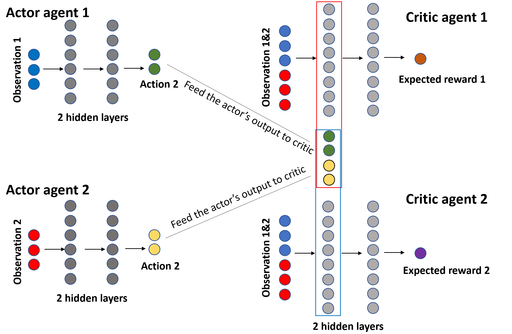

# Project 2: Continuous Control
Yu Tao

## Overview

In this project, a reinforcement learning (RL) agent, a double-jointed arm, was trained to reach target locations.

For this project, the Unity [Reacher](https://github.com/Unity-Technologies/ml-agents/blob/master/docs/Learning-Environment-Examples.md#reacher) environment was used. In this environment, a double-jointed arm can move to target locations. A reward of **+0.1** is provided for each step that the agent's hand is in the goal location. Thus, the goal of your agent is to maintain its position at the target location for as many time steps as possible.

The observation space consists of **33** variables corresponding to position, rotation, velocity, and angular velocities of the arm. Each action is a vector with four numbers, corresponding to torque applicable to two joints. Every entry in the action vector should be a number between **-1 and 1**.

For this project, you can choose either one of the two separate versions of the Unity environment. The first version contains **a single agent**, the second version contains **20 identical agents**, each with its own copy of the environment. The second version is useful for algorithms like [PPO](https://arxiv.org/pdf/1707.06347.pdf), [A3C](https://arxiv.org/pdf/1602.01783.pdf), and [D4PG](https://openreview.net/pdf?id=SyZipzbCb) that use multiple (non-interacting, parallel) copies of the same agent to distribute the task of gathering experience. This task is episodic, and in order to solve the environment, your agent(s) must get an average score of **+30** over **100** consecutive episodes.

## Learning Algorithm

### Deep Deterministic Policy Gradient (DDPG)
This project implements an off-policy method called **Deep Deterministic Policy Gradient**, the details can be found in [this paper](https://arxiv.org/pdf/1509.02971.pdf), written by researchers at Google Deepmind. The DDPG algorithm belongs to the actor-critic methods, that use deep function approximators to learn policies in high-dimensional, continuous action spaces.

The implementation details can be found in the **DDPG_agent.py** file in this repository.

### Actor-Critic Method
Actor-critic methods leverage the strengths of both policy-based and value-based methods. Using a policy-based approach, the agent (actor) learns how to act by directly estimating the optimal policy and maximizing reward through gradient ascent. Meanwhile, employing a value-based approach, the agent (critic) learns how to estimate the value (i.e., the future cumulative reward) of different state-action pairs. Actor-critic methods combine these two approaches in order to accelerate the learning process. Actor-critic agents are also more stable than value-based agents, while requiring fewer training samples than policy-based agents.

The implementation details can be found in the **model.py** file in this repository.

### Hyperparameters

The DDPG used the following hyperparameters (details in ddpg_agent.py)

```
BUFFER_SIZE = int(1e5)  # replay buffer size
BATCH_SIZE = 128        # minibatch size
GAMMA = 0.99            # discount factor
TAU = 1e-3              # for soft update of target parameters
LR_ACTOR = 1e-3         # learning rate of the actor 
LR_CRITIC = 1e-3        # learning rate of the critic
WEIGHT_DECAY = 0        # L2 weight decay
```

### Model Architecture

The model architecture is as follows (details in model.py):

For the actor part, it consists of 3 fully connnected layers:
```
self.fc1 = nn.Linear(state_size, fc1_units)
self.fc2 = nn.Linear(fc1_units, fc2_units)
self.fc3 = nn.Linear(fc2_units, action_size)
```

For the critic part, it consists of 3 fully connnected layers:
```
self.fcs1 = nn.Linear(state_size, fcs1_units)
self.fc2 = nn.Linear(fcs1_units+action_size, fc2_units)
self.fc3 = nn.Linear(fc2_units, 1)
```

The Actor received 33 variables (observation space) as input and generated 4 numbers (predicted action)as output. The first two fully connected layers were followed by ReLU activation function while the third fully connected layers were followed by tanh activation function to output vector between -1 and 1. The Actor is used to approximate the optimal policy π deterministically.

The Critic received 33 variables (observation space) as input, and its first hidden layer was stacked with the Actor's output layer as the Critic's second hidden layer. Eventually giving predictions on the target value, the optimal action-value function Q(s,a), by using the Actor's best-believed action.

The visualization of the model architecture is as follows:



The networks used the Adam optimizer, and the learning rate was set to 0.001, with a batch size of 128.

### Plot of Rewards


The second environment was used, which is to train on **20 identical agents**. This model solved the environment in **20** episodes, which meets the requirement that the agents are able to receive an average reward (over 100 episodes, and over all 20 agents) of at least +30. The final model is saved in **checkpoint_actor.pth** and **checkpoint_critic.pth**.

## Ideas for Future Work

To improve the performance of the agent(s), there are several ideas to tune the DDPG algorithm we have used:
- Through **trial and error** and test out other combinations of the hyperparameters, there might be other sets of values that could solve the environment faster.
- DDPG used minibatches taken uniformly from the replay buffer. We can test out the **prioritized replay buffer** and compare the results.
- The requirement of the task was set to a score of +30 over 100 consecutive episodes. With a **higher target score**, the agents might do better.

There are also other actor-critic methods available for us to explore, such as [A3C - Asynchronous Advantage Actor-Critic](https://arxiv.org/abs/1602.01783), [PPO - Proximal Policy Optimization](https://arxiv.org/pdf/1707.06347.pdf), [D4PG - Distributed Distributional Deterministic Policy Gradients](https://arxiv.org/pdf/1804.08617.pdf), etc. We can run this project on these algorithms and compare the results.
